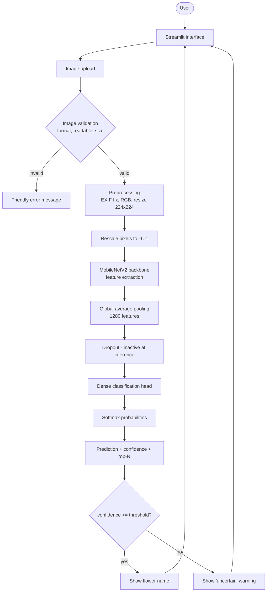
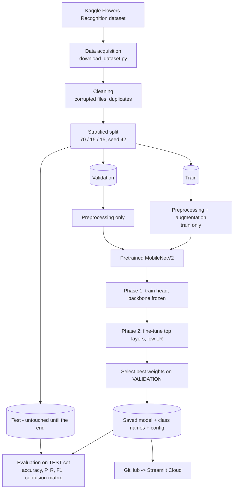
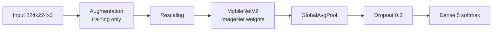

# Architecture diagrams (Mermaid)

GitHub renders these automatically. To put them in your Word/PDF report: open <https://mermaid.live>, paste a diagram,
click **Actions -> PNG/SVG**. In PyCharm, install the free *Mermaid* plugin to preview.

## 1. Inference (what happens when a user uploads a photo)

## 2. Training pipeline

## 3. Model layers

